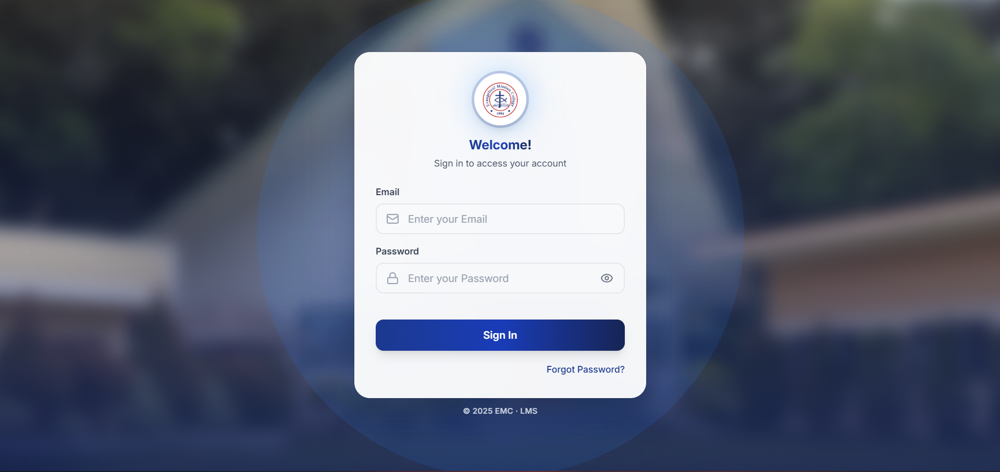
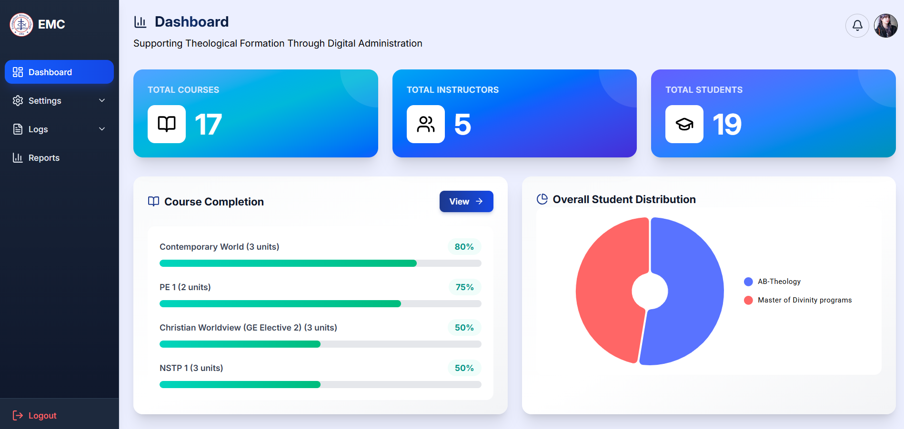
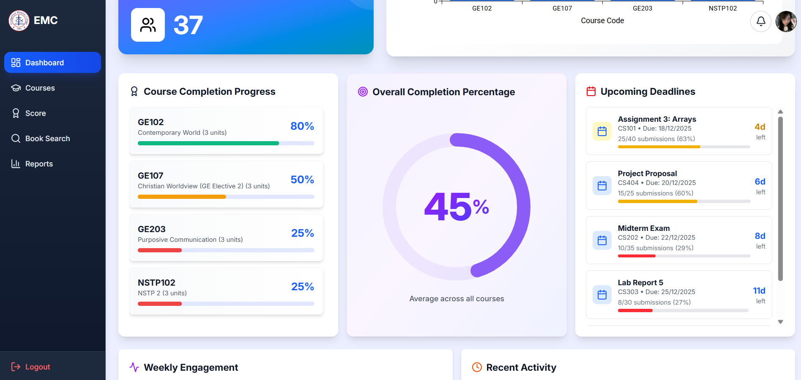
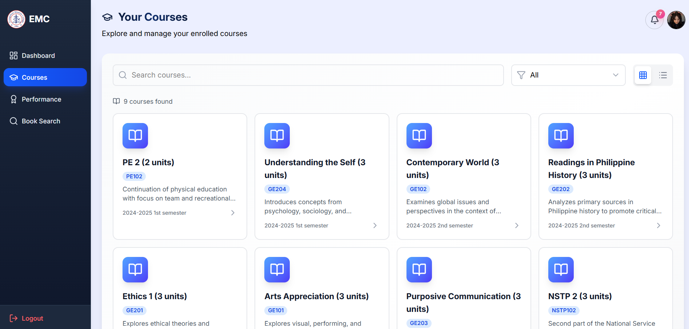
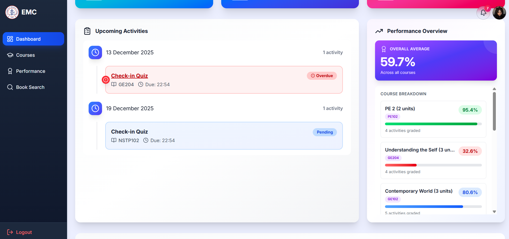

# EMCLMS - Evangelical Mission College Learning Management System

## Quick Start (Docker)

To easily run the entire project without installing dependencies manually on your machine, you can use Docker Compose. This setup will spin up the PostgreSQL database, Django backend, and React frontend simultaneously.

### Prerequisites
- [Docker](https://docs.docker.com/get-docker/) installed.
- [Docker Compose](https://docs.docker.com/compose/install/) installed.

### Run the Project

1. Open your terminal in the root directory (where `docker-compose.yml` is located).
2. Run the following command to build and start the containers:
   ```bash
   docker-compose up --build
   ```
3. Wait for the build process to finish and for all the services to start.
4. Once the terminal shows that the server is running, open your browser and navigate to:
   - **Frontend UI:** [http://localhost:5173](http://localhost:5173)
   - **Backend API:** [http://localhost:8000](http://localhost:8000)

**Note:** The backend container will automatically apply database migrations and collect static files upon startup. 

If you want to seed the database with initial sample data, open a **new terminal** and run:
```bash
docker-compose exec backend python api/seeds.py
```

To stop the servers, just press `Ctrl + C` in the terminal where Docker is running, or run:
```bash
docker-compose down
```

---


A full-stack learning management system built with Django and React.

## EMC LMS Screenschots







## Directory Structure

```
C:\Users\zoren\Documents\VScodeProjects\EMCLMS\
├───.gitattributes
├───.gitignore
├───README.md
├───tree.txt
├───.git\...
├───.vscode\
│   └───tasks.json
├───backend\
│   ├───db.sqlite3
│   ├───manage.py
│   ├───requirements.txt
│   ├───api\
│   │   ├───__init__.py
│   │   ├───admin.py
│   │   ├───apps.py
│   │   ├───embedding_utils.py
│   │   ├───models.py
│   │   ├───seeds.py
│   │   ├───tests.py
│   │   ├───urls.py
│   │   ├───views.py
│   │   ├───__pycache__\
│   │   ├───management\
│   │   │   └───commands\
│   │   │       ├───generate_book_embeddings.py
│   │   │       └───__pycache__\
│   │   ├───migrations\
│   │   │   ├───__init__.py
│   │   │   ├───0001_initial.py
│   │   │   └───...
│   │   ├───templates\
│   │   │   ├───admin_report_template.html
│   │   │   ├───instructor_report_template.html
│   │   │   └───student_report_template.html
│   │   └───views\
│   │       ├───__init__.py
│   │       └───...
│   ├───core\
│   │   ├───__init__.py
│   │   ├───asgi.py
│   │   ├───settings.py
│   │   ├───urls.py
│   │   ├───wsgi.py
│   │   └───__pycache__\
│   ├───media\
│   │   └───content_files\
│   └───venv\
│       ├───Include...\
│       ├───Lib...\
│       ├───Scripts...\
│       └───share...\
└───frontend\
    ├───.gitignore
    ├───eslint.config.js
    ├───index.html
    ├───package-lock.json
    ├───package.json
    ├───README.md
    ├───tsconfig.app.json
    ├───tsconfig.json
    ├───tsconfig.node.json
    ├───vite.config.ts
    ├───dist...\
    ├───node_modules...\
    ├───public\
    │   └───...\
    └───src\
        ├───index.css
        ├───main.tsx
        ├───theme.ts
        ├───vite-env.d.ts
        ├───hooks\
        ├───pages\
        │   └───...\
        └───types\
            └───...\
```

## Backend Setup

1. **Navigate to the backend directory:**
   ```bash
   cd backend
   ```

2. **Create a virtual environment:**
   ```bash
   python -m venv venv
   ```

3. **Activate the virtual environment:**
   - On Windows:
     ```bash
     venv\Scripts\activate
     ```
   - On macOS/Linux:
     ```bash
     source venv/bin/activate
     ```

4. **Install the required dependencies:**
   ```bash
   pip install -r requirements.txt
   ```

5. **Run database migrations:**
   ```bash
   python manage.py migrate
   ```

6. **Start the development server:**
   ```bash
   python manage.py runserver
   ```
   The backend will be running at `http://127.0.0.1:8000/`.

## Frontend Setup

1. **Navigate to the frontend directory:**
   ```bash
   cd frontend
   ```

2. **Install the required dependencies:**
   ```bash
   npm install
   ```

3. **Start the development server:**
   ```bash
   npm run dev
   ```
   The frontend will be running at `http://localhost:5173/`.

## Available Scripts

In the `frontend` directory, you can run the following scripts:

- `npm run dev`: Starts the development server.
- `npm run build`: Builds the app for production.
- `npm run lint`: Lints the code.
- `npm run preview`: Previews the production build.

## Database

The project uses PostgreSQL as the database.

1. **Set up a PostgreSQL database.**
2. **Update the database settings in `backend/core/settings.py`:**
   ```python
   DATABASES = {
       'default': {
           'ENGINE': 'django.db.backends.postgresql',
           'NAME': 'your_db_name',
           'USER': 'your_db_user',
           'PASSWORD': 'your_db_password',
           'HOST': 'localhost',
           'PORT': '5432',
       }
   }
   ```

To seed the database with initial data, run the following command in the `backend` directory:

```bash
python api/seeds.py
```
