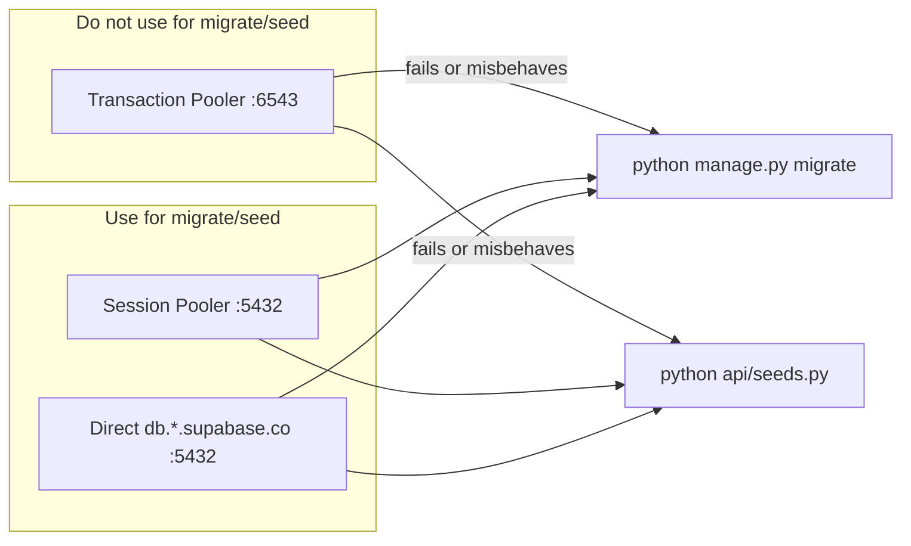

# Supabase Migration and Seeding Guide

This guide documents a common issue when running Django migrations or seed scripts against a remote **Supabase** database from a local machine or Docker, and how to fix it.

## The Problem

Symptoms you may see:

- `python manage.py migrate` fails or hangs when pointed at Supabase
- `python api/seeds.py` appears to run but **Supabase tables stay empty**
- Connection works for simple queries but DDL or bulk writes fail
- Commands succeed locally but only update the **Docker Postgres** container, not Supabase

Production deploy on Render often works fine while local migrate/seed against Supabase does not. That usually means the connection string or command target is wrong—not that Supabase itself is broken.

---

## Root Causes

### 1. Transaction Pooler (port 6543) is wrong for migrate/seed

Supabase offers three connection types:

| Connection | Host / port | Safe for migrate/seed? |
|---|---|---|
| **Transaction Pooler** | `*.pooler.supabase.com:6543` | **No** |
| **Session Pooler** | `*.pooler.supabase.com:5432` | **Yes** |
| **Direct** | `db.<project-ref>.supabase.co:5432` | **Yes** |

**Transaction Pooler** is designed for short, stateless API traffic (e.g. serverless). It does **not** support what Django needs for migrations and seeding:

- Advisory locks on `django_migrations`
- DDL (`CREATE TABLE`, `ALTER SEQUENCE`, etc.)
- Long transactions (`transaction.atomic()` in `api/seeds.py`)
- Session-scoped operations like `ALTER SEQUENCE` in seed helpers

Use **Session Pooler (5432)** or **Direct** for `manage.py migrate` and `api/seeds.py`.

### 2. Docker Compose targets the local database by default

[`docker-compose.yml`](../../docker-compose.yml) hardcodes:

```yaml
DATABASE_URL=postgresql://emclms_user:emclms_password@db:5432/emclms
```

So this command updates the **local Docker Postgres**, not Supabase:

```bash
docker compose exec backend python manage.py migrate
```

You must pass `-e DATABASE_URL=...` with your Supabase Session Pooler URL on the **same command line**.

### 3. Broken multi-line Docker commands

This pattern is incorrect—the `python` line runs on your **host**, not inside the container:

```bash
docker compose exec -e DATABASE_URL="..." backend
python manage.py migrate
```

The migrate/seed command must be on the **same line** as `docker compose exec`.

### 4. SSL (already handled in this project)

Supabase requires SSL. [`backend/core/settings.py`](../../backend/core/settings.py) sets `sslmode: require` when the URL contains `supabase`. No extra SSL config is needed if you use a Supabase host in `DATABASE_URL`.

### 5. Pooler username vs real `postgres` role (backup/restore)

Supabase pooler URLs use usernames like `postgres.<PROJECT_REF>`. That string is an **authentication alias** for the pooler—it is **not** a PostgreSQL role in `pg_roles`. The only real admin role is `postgres`.

| Operation | Pooler `DATABASE_URL` OK? | Notes |
|---|---|---|
| Normal API traffic on Render | **Yes** | Keep Session Pooler in `DATABASE_URL` |
| `manage.py migrate` / `api/seeds.py` | **Yes** | Session Pooler (5432) or Direct |
| In-app DB backup / restore | **Yes** | [`backend/api/utils/db_admin.py`](../../backend/api/utils/db_admin.py) normalizes to direct `postgres` internally |
| Manual `pg_dump` / `pg_restore` | Use **Direct** | `-U postgres` and host `db.<PROJECT_REF>.supabase.co` |

**Cross-Supabase restore:** A `.dump` from an old Supabase project can be restored to a new one via Database Administration → System Restoration. Dumps are created with `--no-owner` and `--no-privileges`, so old project role names are not required on the target database.

### 6. Windows console encoding during seeding

On Windows, `api/seeds.py` may fail with `UnicodeEncodeError` on emoji in `print()` output. Set UTF-8 before running:

```powershell
$env:PYTHONIOENCODING='utf-8'
```

---

## Solution Overview



1. Set `DATABASE_URL` to **Session Pooler** (port **5432**), not Transaction Pooler (port **6543**).
2. When using Docker, override `DATABASE_URL` with `-e` on a **single-line** `docker compose exec` command.
3. Run migrate, then seed.
4. Confirm rows in Supabase Table Editor.

---

## Get the Correct Connection String

In **Supabase Dashboard → Project Settings → Database → Connection string**:

1. Enable **Use connection pooler**.
2. Set **Mode** to **Session** (port **5432**).
3. Copy the URI and replace `[YOUR-PASSWORD]` with your database password.

Example format:

```
postgresql://postgres.<PROJECT_REF>:<PASSWORD>@aws-0-<REGION>.pooler.supabase.com:5432/postgres
```

If Session Pooler fails (network/IPv6 issues), use **Direct connection**:

```
postgresql://postgres:<PASSWORD>@db.<PROJECT_REF>.supabase.co:5432/postgres
```

> **Password special characters:** URL-encode them in the connection string (`#` → `%23`, `!` → `%21`, `@` → `%40`). See [DEPLOYMENT.md](../../DEPLOYMENT.md).

Put the URL in [`backend/.env`](../../backend/.env):

```env
DATABASE_URL=postgresql://postgres.<PROJECT_REF>:<PASSWORD>@aws-0-<REGION>.pooler.supabase.com:5432/postgres
```

---

## Step-by-Step: Migrate and Seed Supabase

### Option A — Run on the host (recommended when Docker is unavailable)

From the project root:

```powershell
cd backend
```

**1. Test connectivity**

```powershell
venv\Scripts\python.exe -c "import django, os; os.environ.setdefault('DJANGO_SETTINGS_MODULE','core.settings'); django.setup(); from django.db import connection; connection.ensure_connection(); print('OK:', connection.settings_dict['HOST'], connection.settings_dict['PORT'])"
```

Expected output includes your pooler host and port `5432`.

**2. Run migrations**

```powershell
venv\Scripts\python.exe manage.py migrate
```

**3. Seed the database**

```powershell
$env:PYTHONIOENCODING='utf-8'
venv\Scripts\python.exe api\seeds.py
```

For minimal production data (admin accounts only):

```powershell
venv\Scripts\python.exe api\emptyseeds.py
```

**4. Verify**

```powershell
venv\Scripts\python.exe -c "import django, os; os.environ.setdefault('DJANGO_SETTINGS_MODULE','core.settings'); django.setup(); from api.models import User; print('Users:', User.objects.count())"
```

Or check **Supabase → Table Editor** for `users`, `courses`, `books`, etc.

---

### Option B — Run from Docker

Run from the **project root** (`emc-lms/`). Replace the placeholder URL with your Session Pooler string.

**1. Test connectivity**

```powershell
docker compose exec -e DATABASE_URL="postgresql://postgres.<REF>:<PASSWORD>@aws-0-<REGION>.pooler.supabase.com:5432/postgres" backend python -c "import django, os; os.environ.setdefault('DJANGO_SETTINGS_MODULE','core.settings'); django.setup(); from django.db import connection; connection.ensure_connection(); print('OK:', connection.settings_dict['HOST'])"
```

**2. Migrate**

```powershell
docker compose exec -e DATABASE_URL="postgresql://postgres.<REF>:<PASSWORD>@aws-0-<REGION>.pooler.supabase.com:5432/postgres" backend python manage.py migrate
```

**3. Seed**

```powershell
docker compose exec -e DATABASE_URL="postgresql://postgres.<REF>:<PASSWORD>@aws-0-<REGION>.pooler.supabase.com:5432/postgres" backend python api/seeds.py
```

---

## Default Accounts After Seeding

After `api/seeds.py` (see [Seeding Guide](./seeding_guide.md) and [DEPLOYMENT.md](../../DEPLOYMENT.md)):

| Role | Email | Password |
|---|---|---|
| Superadmin | `superadmin@gmail.com` | `asd123ASD` |
| Admin | `admin@gmail.com` | `asd123ASD` |
| Librarian | `librarian@gmail.com` | `asd123ASD` |
| Accounting | `accounting@gmail.com` | `asd123ASD` |

Change these passwords in production immediately.

---

## Checklist

- [ ] `DATABASE_URL` uses Session Pooler **port 5432**, not Transaction Pooler **port 6543**
- [ ] Password is URL-encoded if it contains special characters
- [ ] Docker commands include `-e DATABASE_URL=...` on the **same line** as `python manage.py migrate` / `python api/seeds.py`
- [ ] Migrate completed before seeding
- [ ] Verified row counts or checked Supabase Table Editor

---

## What NOT to Do

| Mistake | Why it fails |
|---|---|
| Use Transaction Pooler (`:6543`) for migrate/seed | Breaks DDL, locks, and long transactions |
| `docker compose exec backend python manage.py migrate` without `-e DATABASE_URL` | Writes to local Docker Postgres, not Supabase |
| Split `docker compose exec` and `python ...` across two lines | Command runs on host, not in container |
| Expect `docker-compose.yml` to read Supabase from `backend/.env` | Compose `environment:` overrides `DATABASE_URL` |

---

## Related Documentation

- [Backend Setup](./backend_setup.md) — local Django environment
- [Seeding Guide](./seeding_guide.md) — what each seeder does
- [DEPLOYMENT.md](../../DEPLOYMENT.md) — production Supabase and Render setup
